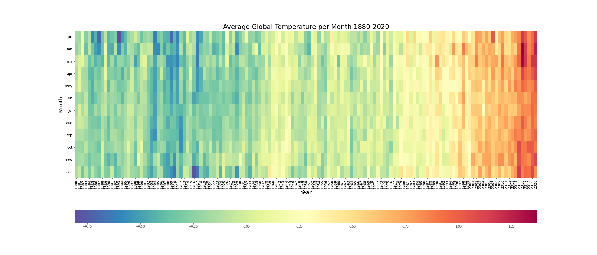
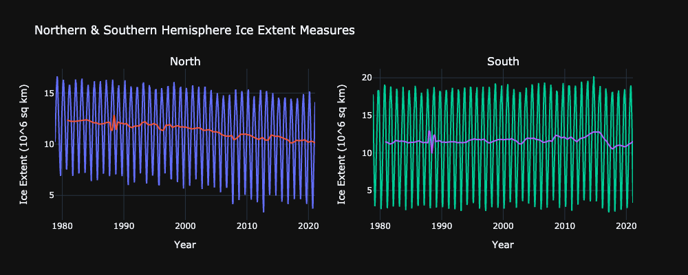

# Global Warming

Global warming is the long-term gradual increase of the Earths surface, atmosphere and its oceans. A change that is believed to be permanently changing the Earths climate. Since the industrial period (between 1850-1900) there has been a reported increase in the Earths temperature largely due to human activities, such as fossil fuel burning, land clearing and agriculture, that has caused an increase in carbon dioxide and other greenhouse gasses in the Earths atmosphere.  The continued rising levels of greenhouse gasses means that future generations will be presented with more extreme weather events, rising temperatures, rising sea levels due to the melting of polar ice caps, as well as disruption to marine and land ecosystems. 

The aim of this project is to explore the data surrounding global warming and its effects.  The data presented aims to bring awareness to the impending global crisis and to aid in conversations regarding mitigative efforts and solutions. Can we slow or even reverse global warming? Is it too late?

### January Surface Temperature

### Global Surface Temperature

The dataset spans over a period of 138 years in which the global temperature appears to increase over time. Additionally, the color gradiation from month to month per year also indicates an increase in global temperature. According to an ongoing temperature analysis conducted by scientists at NASA’s Goddard Institute for Space Studies (GISS), the average global temperature on Earth has increased by a little more than 1° Celsius (2° Fahrenheit) since 1880. Two-thirds of the warming has occurred since 1975, at a rate of roughly 0.15-0.20°C per decade.

### Impact of Rising Temperature on Sea Ice

The Sea Ice data files are used to look at trends in sea ice cover in the Arctic and Antartic oceans. Data is available from October 1978 to December 2020. The datasets used for this section will analyze the changes to the global sea ice extent based on the daily satelite measurements from the National Snow and Ice Data Center.

### Credits

All data, available for public use, is sourced from NASA Goddard Institute for Space Studies. This project does not claim any ownership over the data, and is not reponsible for guaranteeing accuracy of the data.

#### DATA SOURCE: NASA Goddard Institute for Space Studies¶
GISTEMP Team, 2021: GISS Surface Temperature Analysis (GISTEMP), version 4. NASA Goddard Institute for Space Studies. Dataset accessed 2021-01-01 at https://data.giss.nasa.gov/gistemp/.
Lenssen, N., G. Schmidt, J. Hansen, M. Menne, A. Persin, R. Ruedy, and D. Zyss, 2019: Improvements in the GISTEMP uncertainty model. J. Geophys. Res. Atmos., 124, no. 12, 6307-6326, doi:10.1029/2018JD029522.
https://data.giss.nasa.gov/gistemp/ Date of Access: January 2021

Sea Ice Datasets: All archived data reside in the following FTP location: ftp://sidads.colorado.edu/DATASETS/NOAA/G02135/ ftp://sidads.colorado.edu/DATASETS/NOAA/G02135/north/daily/data/ ftp://sidads.colorado.edu/DATASETS/NOAA/G02135/south/daily/data/

